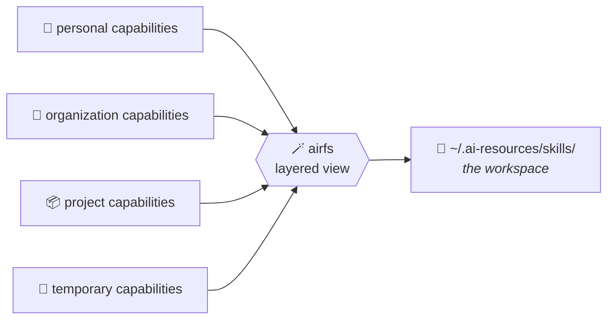
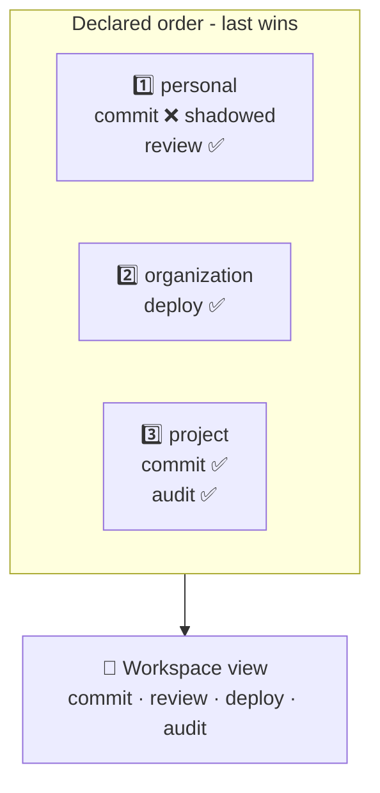

# AiRFS 🪄

**Assemble AI workspaces through a layered filesystem of reusable capabilities: many sources, one read-only view, no copies.**

**AiRFS** assembles isolated AI workspaces from reusable capabilities - skills,
agents, commands, tools, and whatever comes next - each capability staying in the
repository that owns it.

One personal workspace, one work workspace, one workspace per project: each can
reuse the same underlying capabilities while exposing only what is relevant to
its context.

📖 **[Documentation](https://sylvanld.github.io/airfs/)** ·
🚀 **[Get started](https://sylvanld.github.io/airfs/get-started/)** ·
📚 **[User guide](https://sylvanld.github.io/airfs/user-guide/)**

## The problem 🧩

AI capabilities accumulate quickly. Skills, agents, commands, and tools live
across personal, work, and project contexts, while agentic tools expect a single
view of what is available. That leaves three bad options:

- **Scattered** - the tool sees only one of your contexts.
- **Copied** - every copy drifts from the capability it came from.
- **All of it, everywhere** - one flat pile that noises up every context.

## What an AiRFS workspace is ✨

A workspace is an environment for AI capabilities - what a virtualenv is to
Python packages, or a Nix profile to system tools. You declare the layers it is
assembled from, in order:



Nothing is moved and nothing is duplicated. Each capability keeps living in (and
is edited in) its own repository; the workspace is a view onto them. Edit a file
in its repository and the change is visible through every workspace that layers
it, immediately - no sync step, no copy to refresh. 🔄

Every workspace gets its own view, so the same capability can be shared by many
workspaces without any of them seeing the others' layers. Every workspace on the
machine is declared in **one file** and held by **one daemon**, so "what is
`airfs` doing here?" has one answer you can read and diff. 🏛️

## How workspaces are composed 🥇

Layers are an **ordered** list, and that order *is* the precedence order. They
are declared from the most general to the most specific, so when two layers both
ship a skill named `commit`, the one declared **last** wins - the local
definition beats the global one, and it wins *whole*, never half-assembled from
two places.



> [!TIP]
> Shadowing is always reported, never silent. `airfs inspect` lists every
> shadowed entry with its winner and its losers - a silent shadow is what makes a
> workspace untrustworthy. 🕵️

> [!IMPORTANT]
> The workspace view is intentionally **immutable**. Capabilities are edited in
> the source layer that owns them, which is what keeps a workspace a
> *declaration* of layers rather than a place where state quietly accumulates. A
> new file in the view would belong to *some* repository, and the view has no
> basis to pick one. ✍️

## How a workspace is exposed 🚪

A target holds one FUSE mount per **folder** the workspace declares, and nothing
else:

```
~/.ai-resources/
  agents/         # mountpoint
  skills/         # mountpoint
  commands/       # mountpoint
```

The folder names are yours: `airfs` attaches no meaning to any of them, merges
the directory called what you called it, and never creates one inside a source
repository. Declare `prompts` and it merges `prompts/`.

`airfs up` starts the daemon and serves every enabled workspace, blocking or with
`--detach`; `airfs down` stops it and releases every `airfs` mount on the machine,
stale ones included. Read-only is enforced by the kernel 🛡️, so nothing can write
into a source repository through the view even by mistake.

Mounting needs `/dev/fuse` and a setuid `fusermount3`. Not sure you have them?
Run **`airfs doctor`** - it checks the host and names the package to install. 🩺

## Declaring it ⚙️

One YAML file at `~/.config/airfs/config.yaml`:

```yaml
workspaces:
  personal:
    target: ~/.ai-resources
    folders: [agents, skills, commands]
    sources:
      - ~/repos/personal-capabilities   # 1st - most general
      - ~/repos/org-capabilities        # 2nd - wins every collision
```

Write it by hand, or let `airfs add` write it for you - comments, key order, YAML
anchors and aliases survive an edit either way.

## One daemon, reconciling 🔁

Everything the daemon does is one operation: make what is mounted match what is
declared. Its inputs are your configuration and **every `airfs` mount the kernel
reports** - not just the ones under a target you currently declare.

That is what lets one command account for the whole host, including mounts left
behind by a crashed daemon or a configuration you have since changed. It reads
the kernel rather than a file `airfs` keeps, because a file `airfs` keeps
disagrees with reality exactly when it matters.

> [!TIP]
> The kernel is the inventory; the configuration is the intent. A workspace that
> cannot be established fails **alone** - one mistyped path never takes down the
> rest. 🛡️

## Why pure Go 🐹

The predecessor needed a `mergerfs` binary, which distributions package only for
root, so it had to be unpacked by hand into a user-local prefix. `airfs` speaks
the FUSE protocol over `/dev/fuse` from Go, linking no C library and requiring no
filesystem binary.

> [!NOTE]
> Go dependencies are fine as long as they are cgo-free, so `go install` stays the
> whole installation. Two host requirements remain, because an unprivileged
> process cannot mount without them: `/dev/fuse`, and a **setuid** `fusermount3` -
> which ships with the system FUSE package and is already there on a normal
> desktop Linux.

## Contributing 🤝

> [!IMPORTANT]
> No implementation change without an agreed spec - see [AGENTS.md](AGENTS.md).

Run `make` for the available targets and `make check` before pushing. Setup,
prerequisites, and what each gate verifies are documented under
[Contribute](https://sylvanld.github.io/airfs/contribute/).
