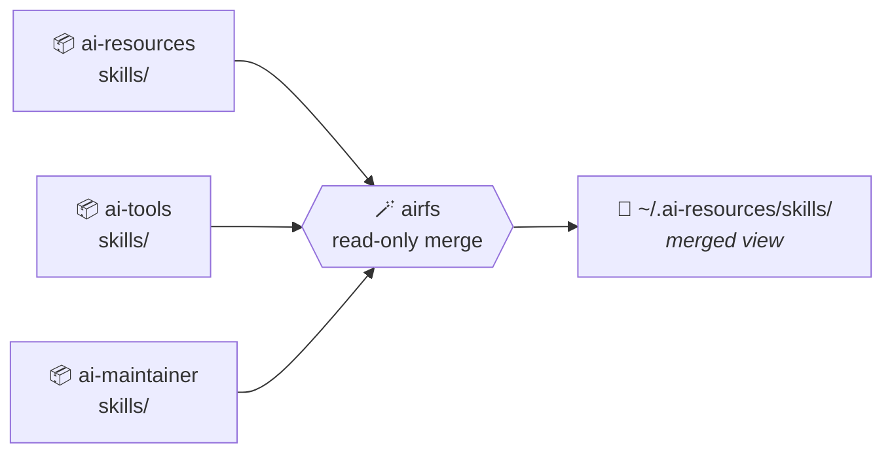
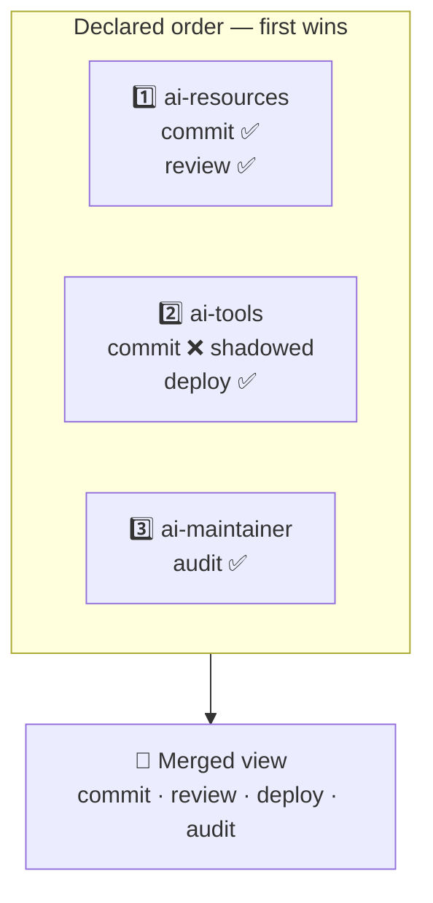

# airfs 🪄

**One directory. Many repositories. No copies.**

`airfs` layers AI resource directories — skills, agents, commands — from several
repositories into a single **read-only merged view**, served as a FUSE mount
written in pure Go. It ships as a Go SDK and a small CLI.

📖 **[Documentation](https://sylvanld.github.io/airfs/)** ·
📐 **[Specs](https://sylvanld.github.io/airfs/specs/)** ·
🚀 **[Get started](https://sylvanld.github.io/airfs/get-started/)**

> [!IMPORTANT]
> **Specification stage.** The specs are `draft` and **no implementation exists
> yet**. `airfs` replaces a `mergerfs`-based `Makefile` setup in
> [ai-resources](https://github.com/hoshiyosan/ai-resources).

## The problem 🧩

Your agent tooling wants every skill under one directory. But skills are authored
in the repository that *owns* them — one per team, per product, per concern. The
usual bridges rot: a **copy** drifts from the original, **hand-made symlinks**
drift from the source list, and **`mergerfs`** is a system binary your
distribution only packages with root.

## The idea ✨

Don't move anything. Merge the directories **in place** and expose the result as
a view. Each resource keeps living in — and is edited in — its own repository.

Edit a file in its repository → the change is visible through the view
immediately. No sync step, no copy to refresh. 🔄

## How the merge behaves 🥇

Sources are an **ordered** list, and that order *is* the precedence order. When
two repositories both ship a skill named `commit`, the one declared **first**
wins — and it wins *whole*, never half-assembled from two places.

> [!TIP]
> Shadowing is always reported, never silent. `airfs sources` lists every
> shadowed entry with its winner and its losers — a silent shadow is what makes a
> merged view untrustworthy. 🕵️

> [!WARNING]
> The view is **read-only**. Writes are rejected, not routed to a source: a new
> file in the merged view belongs to *some* repository and the view has no basis
> to pick one. Edit in the source repo. ✍️

## Two ways to expose it 🚪

Both frontends read through the *same* merge, so the merge semantics are defined
and tested once.

| | 🧵 FUSE mount | 🔗 Symlink farm |
| --- | --- | --- |
| **Command** | `airfs mount` | `airfs sync` |
| **Read-only** | Enforced by the kernel 🛡️ | By convention only |
| **Needs** | `/dev/fuse` + setuid `fusermount3` | Nothing 🎒 |
| **Use when** | You're on a normal Linux desktop | Prerequisites are unavailable |

Not sure which you can use? Run **`airfs doctor`** — it checks the host and names
the package to install. 🩺

## Why pure Go 🐹

The predecessor needed a `mergerfs` binary, which distributions package only for
root, so it had to be unpacked by hand into a user-local prefix. `airfs` speaks
the FUSE protocol over `/dev/fuse` from Go, linking no C library and requiring no
filesystem binary.

> [!NOTE]
> Two host requirements remain, because an unprivileged process cannot mount
> without them: `/dev/fuse`, and a **setuid** `fusermount3` — which ships with the
> system FUSE package and is already there on a normal desktop Linux. Where
> neither is available, the symlink farm materialises the same view, trading the
> kernel-enforced read-only guarantee for portability.

## Contributing 🤝

> [!IMPORTANT]
> No implementation change without an agreed spec — see [AGENTS.md](AGENTS.md).

Run `make` for the available targets and `make check` before pushing. Setup,
prerequisites, and what each gate verifies are documented under
[Contribute](https://sylvanld.github.io/airfs/contribute/).
