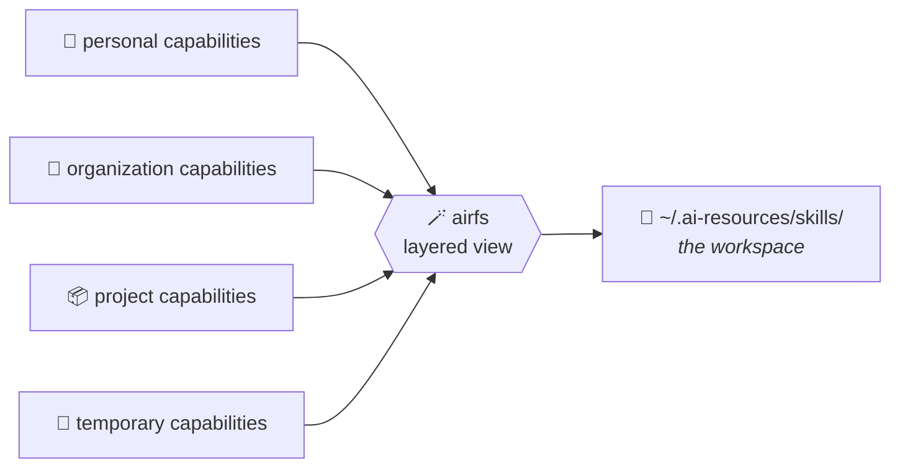
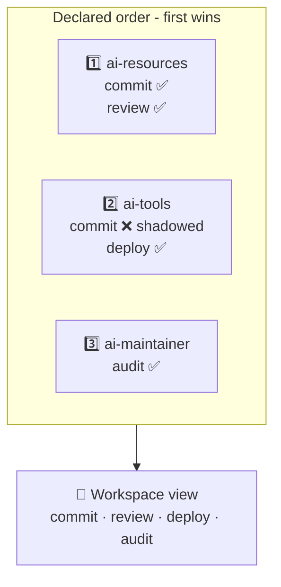

# AiRFS 🪄

**Assemble AI workspaces through a layered filesystem of reusable capabilities: many sources, one read-only view, no copies.**

**AiRFS** assembles isolated AI workspaces from reusable capabilities - skills,
agents, commands, tools, and whatever comes next - each capability staying in the
repository that owns it.

One personal workspace, one work workspace, one workspace per project: each can
reuse the same underlying capabilities while exposing only what is relevant to
its context.

📖 **[Documentation](https://sylvanld.github.io/airfs/)** ·
🚀 **[Get started](https://sylvanld.github.io/airfs/get-started/)**

## The problem 🧩

AI capabilities accumulate quickly. Skills, agents, commands, and tools live
across personal, work, and project contexts, while agentic tools expect a single
view of what is available. That leaves three bad options:

- **Scattered** - the tool sees only one of your contexts.
- **Copied** - every copy drifts from the capability it came from.
- **All of it, everywhere** - one flat pile that noises up every context.

## What an AiRFS workspace is ✨

A workspace is an environment for AI capabilities - what a virtualenv is to
Python packages, or a Nix profile to system tools. You declare the layers it is
assembled from, in order:

Nothing is moved and nothing is duplicated. Each capability keeps living in (and
is edited in) its own repository; the workspace is a view onto them. Edit a file
in its repository and the change is visible through every workspace that layers
it, immediately - no sync step, no copy to refresh. 🔄

Every workspace gets its own view, so the same capability can be shared by many
workspaces without any of them seeing the others' layers.

## How workspaces are composed 🥇

Layers are an **ordered** list, and that order *is* the precedence order. When
two layers both ship a skill named `commit`, the one declared **first** wins -
and it wins *whole*, never half-assembled from two places.

> [!TIP]
> Shadowing is always reported, never silent. `airfs sources` lists every
> shadowed entry with its winner and its losers - a silent shadow is what makes a
> workspace untrustworthy. 🕵️

> [!IMPORTANT]
> The workspace view is intentionally **immutable**. Capabilities are edited in
> the source layer that owns them, which is what keeps a workspace a
> *declaration* of layers rather than a place where state quietly accumulates. A
> new file in the view would belong to *some* repository, and the view has no
> basis to pick one. ✍️

## Two ways to expose a workspace 🚪

Both frontends read through the *same* composition, so the layering semantics are
defined and tested once.

| | 🧵 FUSE mount | 🔗 Symlink farm |
| --- | --- | --- |
| **Command** | `airfs mount` | `airfs sync` |
| **Read-only** | Enforced by the kernel 🛡️ | By convention only |
| **Needs** | `/dev/fuse` + setuid `fusermount3` | Nothing 🎒 |
| **Use when** | You're on a normal Linux desktop | Prerequisites are unavailable |

Not sure which you can use? Run **`airfs doctor`** - it checks the host and names
the package to install. 🩺

## Why pure Go 🐹

The predecessor needed a `mergerfs` binary, which distributions package only for
root, so it had to be unpacked by hand into a user-local prefix. `airfs` speaks
the FUSE protocol over `/dev/fuse` from Go, linking no C library and requiring no
filesystem binary.

> [!NOTE]
> Two host requirements remain, because an unprivileged process cannot mount
> without them: `/dev/fuse`, and a **setuid** `fusermount3` - which ships with the
> system FUSE package and is already there on a normal desktop Linux. Where
> neither is available, the symlink farm materialises the same view, trading the
> kernel-enforced read-only guarantee for portability.

## Contributing 🤝

> [!IMPORTANT]
> No implementation change without an agreed spec - see [AGENTS.md](AGENTS.md).

Run `make` for the available targets and `make check` before pushing. Setup,
prerequisites, and what each gate verifies are documented under
[Contribute](https://sylvanld.github.io/airfs/contribute/).
