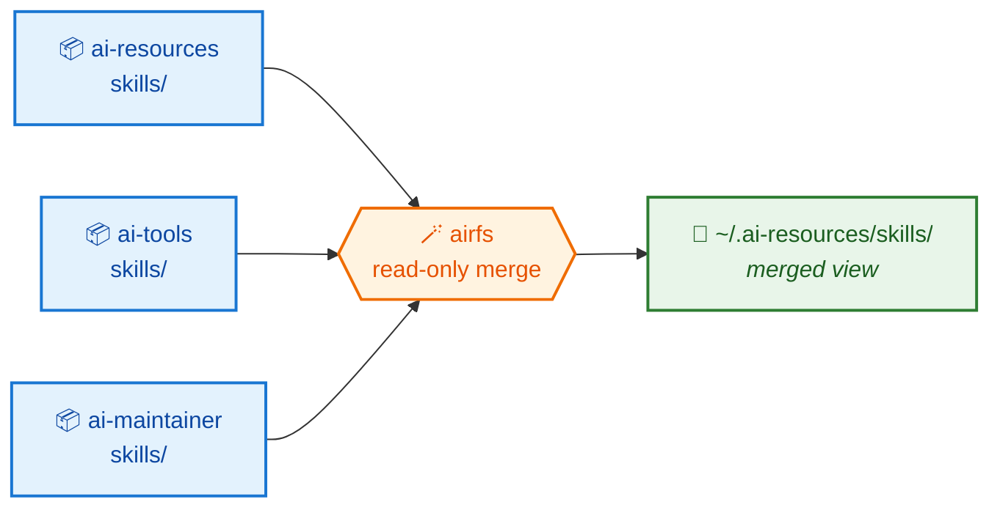
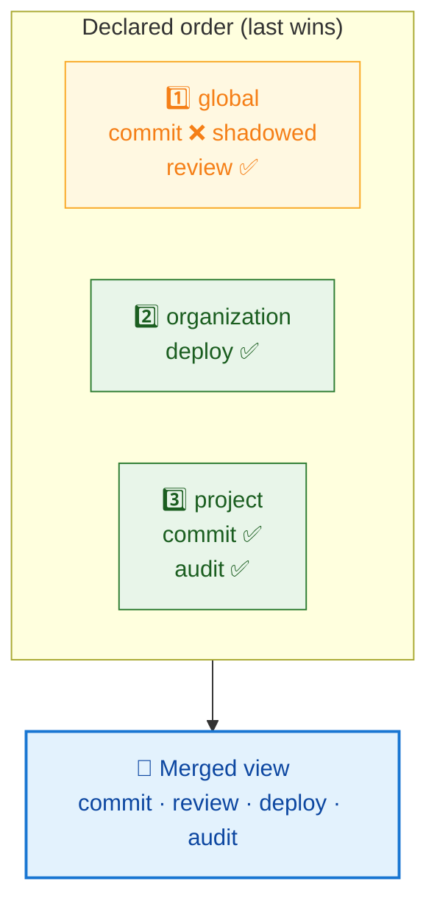

# AirFS

**One directory. Many repositories. No copies.** 🪄

`airfs` is a Go SDK — and a small CLI — that layers AI resource directories
(agents, skills, commands, scripts) from several repositories into a single
**read-only merged view**, served as a FUSE mount written in pure Go.

---

## 🧩 The problem

Your agent tooling wants every skill under one directory:

```
~/.ai-resources/skills/
```

But skills are authored in the repository that *owns* them — one per team, per
product, per concern. So you have to bridge the gap, and the usual bridges rot:

!!! danger "What doesn't work"

    - 📋 **Copying** — the copy drifts from the original the moment someone edits it.
    - 🔗 **Hand-made symlinks** — they drift from the source list instead.
    - 🧱 **`mergerfs`** — a system binary your distribution only packages with root.

## ✨ The idea

Don't move anything. **Merge the directories in place** and expose the result as
a view. Each resource keeps living in — and is edited in — its own repository.



Edit a file in its repository → the change is visible through the view
immediately. No sync step, no copy to refresh. 🔄

---

## 🗂️ The vocabulary

Five words carry the whole model.

<div class="grid cards" markdown>

-   **📦 Source**

    One contributing directory tree — normally a git working copy. Sources are an
    **ordered** list, and that order *is* the precedence order.

-   **🏷️ Kind**

    A category of resource = one subdirectory name: `agents`, `skills`,
    `commands`, `scripts`. The set is fixed and built in, so unrelated top-level
    directories can never leak into the view.

-   **📄 Entry**

    One resource inside a kind, named directly under it — a directory like a
    skill, or a single file like a command. The entry is what collides and what
    gets shadowed, and it is shadowed *whole*.

-   **🥞 Stratum**

    One source's contribution to one kind — `<source>/<kind>/`. A kind's view is
    the ordered stack of its strata.

-   **🎯 Target**

    The resource folder the view lives under — `~/.ai-resources` by default. It
    holds the configuration file and one mounted subdirectory per kind.

</div>

---

## 🥇 Precedence: latest source wins

Sources are declared from the most **general** to the most **specific** — global,
then organisation, then project. When two repositories both ship a skill named
`commit`, the one declared **last** wins, and it wins *whole* — no half-merged
resource assembled from two places.



Precedence is **independent per kind**: a source can win `commit` under `skills`
while losing `commit` under `commands`.

!!! tip "Shadowing is always reported, never silent"

    `airfs sources` lists every shadowed entry with its winner and its losers.
    A silent shadow is the failure mode that makes a merged view untrustworthy —
    you edit a file, nothing happens, and nothing tells you why. 🕵️

!!! warning "The view is read-only"

    Writes are rejected, not routed to a source — and the kernel enforces it, so
    no process can write through the mount even by mistake. A new file in the
    merged view belongs to *some* repository and the view has no basis to pick
    one; a write that succeeded would bypass that repository's git history,
    review, and tests. **Edit in the source repo.** ✍️

---

## 🚪 How the view is exposed

One FUSE mount **per kind**, all served by one process:

```
~/.ai-resources/
  sources.txt     # the ordered layers — never masked by a mount
  agents/         # mountpoint
  skills/         # mountpoint
  commands/       # mountpoint
  scripts/        # mountpoint
```

`airfs mount` establishes them together and blocks while serving; `--detach` runs
it as a daemon instead. `airfs umount` releases them — including a stale
mountpoint left behind by a serving process that died.

Mounting needs `/dev/fuse` and a setuid `fusermount3`, both of which ship with
your distribution's FUSE package. Not sure you have them? Run **`airfs doctor`** —
it checks the host and names the package to install. 🩺

---

## ⚙️ Configuring it

One plain-text file at the root of the target, one path per line. The most common
diff is a single added line.

```bash
# ~/.ai-resources/sources.txt — order is precedence, last wins
~/sylvan/ai-resources      # 1st — global
~/sylvan/ai-tools          # 2nd
$WORK/ai-maintainer        # 3rd — wins every collision
```

Comments, `~`, and `$VAR` are expanded; relative paths resolve against the
config file's own directory, never the working directory. An unset variable or a
missing source directory is an **error**, not a shrug — a view quietly missing a
repository is the harder failure to diagnose. 🚧

---

## 🛠️ The commands

| Command | Does |
| --- | --- |
| `sources` 🔍 | Resolve the config and report it: order, counts per kind, shadowing. Touches nothing. |
| `mount` 🧵 | Serve the merged view under the target, one mount per kind. `--detach` to daemonise. |
| `umount` 🧹 | Release the mounts, including stale ones. |
| `status` 📊 | Whether the target is served, live or stale — and what's visible through it. |
| `doctor` 🩺 | Check `/dev/fuse` and `fusermount3`, and say what to install. |

---

## 🚧 Status

!!! success "Implemented"

    Every spec in [`docs/specs/`](specs/index.md) is `implemented`: the library
    and the `airfs` command exist, and the merge, the mount, and the CLI are
    covered by tests. `airfs` replaces a `mergerfs`-based `Makefile` setup in
    [ai-resources](https://github.com/hoshiyosan/ai-resources).

    No implementation change lands without an agreed spec.

## 👉 Where next

- 🚀 [Get started](get-started.md) — install and first mount, in five minutes
- 📚 [User guide](user-guide/index.md) — layers, precedence, mounting, the Go API
- 📐 [Specs](specs/index.md) — the model, the merge, the mount, the CLI
- 🤝 [Contribute](contribute/index.md) — setup, targets, and quality gates
