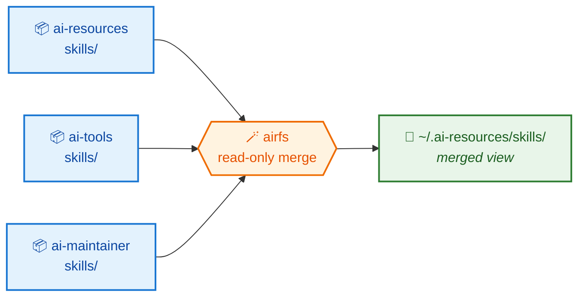
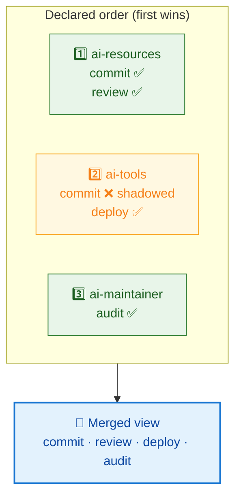

# AirFS

**One directory. Many repositories. No copies.** 🪄

`airfs` is a Go SDK — and a small CLI — that layers AI resource directories
(skills, agents, commands) from several repositories into a single **read-only
merged view**, served as a FUSE mount written in pure Go.

---

## 🧩 The problem

Your agent tooling wants every skill under one directory:

```
~/.ai-resources/skills/
```

But skills are authored in the repository that *owns* them — one per team, per
product, per concern. So you have to bridge the gap, and the usual bridges rot:

!!! danger "What doesn't work"

    - 📋 **Copying** — the copy drifts from the original the moment someone edits it.
    - 🔗 **Hand-made symlinks** — they drift from the source list instead.
    - 🧱 **`mergerfs`** — a system binary your distribution only packages with root.

## ✨ The idea

Don't move anything. **Merge the directories in place** and expose the result as
a view. Each resource keeps living in — and is edited in — its own repository.



Edit a file in its repository → the change is visible through the view
immediately. No sync step, no copy to refresh. 🔄

---

## 🗂️ The vocabulary

Four words carry the whole model.

<div class="grid cards" markdown>

-   **📦 Source**

    One contributing directory tree — normally a git working copy. Sources are an
    **ordered** list, and that order *is* the precedence order.

-   **🏷️ Kind**

    A category of resource = one subdirectory name: `skills`, `agents`,
    `commands`. Declared explicitly, so unrelated top-level directories can never
    leak into the view.

-   **📄 Entry**

    One resource inside a kind. A skill is a *directory*; an agent is a *file*.
    That granularity decides what collides and what gets shadowed.

-   **🥞 Stratum**

    One source's contribution to one kind — `<source>/<kind>/`. A kind's view is
    the ordered stack of its strata.

</div>

---

## 🥇 Precedence: earliest source wins

When two repositories both ship a skill named `commit`, the one declared **first**
wins, and it wins *whole* — no half-merged resource assembled from two places.



Precedence is **independent per kind**: a source can win `commit` under `skills`
while losing `commit` under `commands`.

!!! tip "Shadowing is always reported, never silent"

    `airfs sources` lists every shadowed entry with its winner and its losers.
    A silent shadow is the failure mode that makes a merged view untrustworthy —
    you edit a file, nothing happens, and nothing tells you why. 🕵️

!!! warning "The view is read-only"

    Writes are rejected, not routed to a source. A new file in the merged view
    belongs to *some* repository and the view has no basis to pick one — and a
    write that succeeded would bypass that repository's git history, review, and
    tests. **Edit in the source repo.** ✍️

---

## 🚪 Two ways to expose the view

Both frontends read through the *same* merge, so the merge semantics are defined
and tested once.

| | 🧵 FUSE mount | 🔗 Symlink farm |
| --- | --- | --- |
| **Command** | `airfs mount` | `airfs sync` |
| **Read-only** | Enforced by the kernel 🛡️ | By convention only |
| **Needs** | `/dev/fuse` + setuid `fusermount3` | Nothing 🎒 |
| **Lives as long as** | The serving process | Until the sources change |
| **Use when** | You're on a normal Linux desktop | Prerequisites are unavailable |

Not sure which you can use? Run **`airfs doctor`** — it checks the host and names
the package to install. 🩺

---

## ⚙️ Configuring it

One plain-text file, one path per line. The most common diff is a single added
line.

```bash
# sources.txt — order is precedence
kinds: skills=dir, agents=file, commands=file

~/sylvan/ai-resources      # 1st — wins every collision
~/sylvan/ai-tools          # 2nd
$WORK/ai-maintainer        # 3rd
```

Comments, `~`, and `$VAR` are expanded; relative paths resolve against the
config file's own directory, never the working directory. An unset variable or a
missing source directory is an **error**, not a shrug — a view quietly missing a
repository is the harder failure to diagnose. 🚧

---

## 🛠️ The commands

| Command | Does |
| --- | --- |
| `sources` 🔍 | Resolve the config and report it: order, kinds, counts, shadowing. Touches nothing. |
| `mount` 🧵 | Serve the merged view at the target path. |
| `umount` 🧹 | Release the mount, including a stale one. |
| `status` 📊 | Live mount, symlink farm, or neither — and what's visible through it. |
| `sync` 🔗 | Reconcile the symlink farm. A verify mode makes no writes and fails on drift. |
| `doctor` 🩺 | Check `/dev/fuse` and `fusermount3`, and say what to install. |

---

## 🚧 Status

!!! info "Specification stage"

    The specs in [`docs/specs/`](specs/index.md) are `draft`. **No implementation
    exists yet.** `airfs` replaces a `mergerfs`-based `Makefile` setup in
    [ai-resources](https://github.com/hoshiyosan/ai-resources).

    No implementation change lands without an agreed spec.

## 👉 Where next

- 🚀 [Get started](get-started.md) — install and first mount
- 📐 [Specs](specs/index.md) — the model, the merge, the frontends, the CLI
- 🤝 [Contribute](contribute/index.md) — setup, targets, and quality gates
