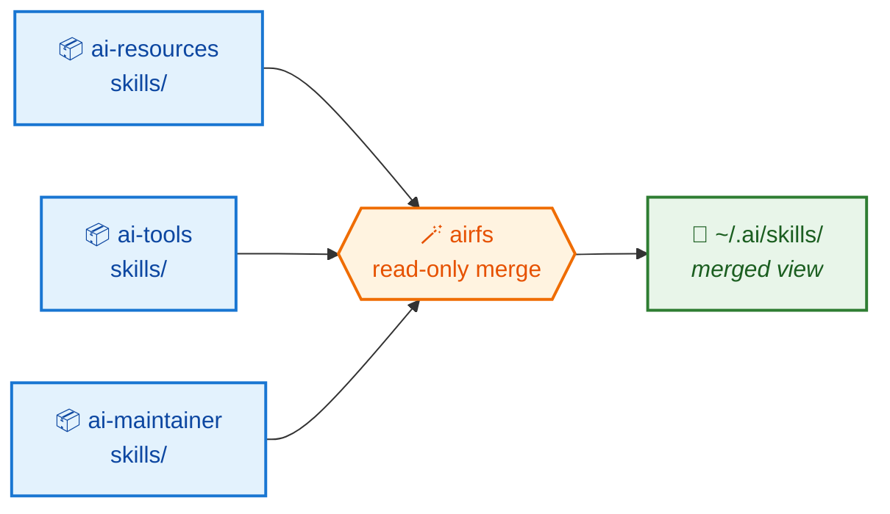
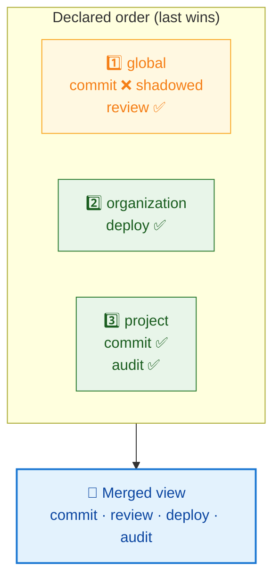

# AirFS

**One directory. Many repositories. No copies.** 🪄

`airfs` is a Go SDK — and a small CLI — that layers AI resource directories from
several repositories into a single **read-only merged view**, served as a FUSE
mount written in pure Go.

Every workspace on your machine is declared in **one file** and held by **one
daemon**, so "what is `airfs` doing here?" has one answer you can read and diff.

---

## 🧩 The problem

Your agent tooling wants every skill under one directory:

```
~/.ai/skills/
```

But skills are authored in the repository that *owns* them — one per team, per
product, per concern. So you have to bridge the gap, and the usual bridges rot:

!!! danger "What doesn't work"

    - 📋 **Copying** — the copy drifts from the original the moment someone edits it.
    - 🔗 **Hand-made symlinks** — they drift from the source list instead.
    - 🧱 **`mergerfs`** — a system binary your distribution only packages with root.

## ✨ The idea

Don't move anything. **Merge the directories in place** and expose the result as
a view. Each resource keeps living in — and is edited in — its own repository.



Edit a file in its repository → the change is visible through the view
immediately. No sync step, no copy to refresh. 🔄

---

## 🗂️ The vocabulary

Five words carry the whole model.

<div class="grid cards" markdown>

-   **📦 Source**

    One contributing directory tree — normally a git working copy. Sources are an
    **ordered** list, and that order *is* the precedence order.

-   **🏷️ Folder**

    A subdirectory name that gets merged and mounted — `skills`, `prompts`,
    whatever you declare. **`airfs` attaches no meaning to any of them**: it
    merges the directory called what you called it, and creates none of them
    inside a source.

-   **📄 Entry**

    One resource inside a folder, named directly under it — a directory like a
    skill, or a single file like a command. The entry is what collides and what
    gets shadowed, and it is shadowed *whole*.

-   **🎯 Target**

    The directory a workspace's merged view is exposed under. `airfs` claims one
    mountpoint per folder inside it and nothing more, so a target can be a
    directory a tool already owns.

-   **🪟 Workspace**

    One named declaration — a target, an ordered list of sources, and the folders
    to merge. It is the unit everything is reported and controlled by.

</div>

## 🥇 Precedence: latest source wins

Sources are declared from the most **general** to the most **specific** — global,
then organisation, then project. When two repositories both ship a skill named
`commit`, the one declared **last** wins, and it wins *whole* — no half-merged
resource assembled from two places.



Precedence is **independent per folder**: a source can win `commit` under
`skills` while losing `commit` under `commands`.

!!! tip "Shadowing is always reported, never silent"

    `airfs inspect` lists every shadowed entry with its winner and its losers.
    A silent shadow is the failure mode that makes a merged view untrustworthy —
    you edit a file, nothing happens, and nothing tells you why. 🕵️

!!! warning "The view is read-only"

    Writes are rejected, not routed to a source — and the kernel enforces it, so
    no process can write through the mount even by mistake. A new file in the
    merged view belongs to *some* repository and the view has no basis to pick
    one; a write that succeeded would bypass that repository's git history,
    review, and tests. **Edit in the source repo.** ✍️

---

## 🚪 How the view is exposed

One FUSE mount **per folder**, and one daemon holding every workspace on the
machine:

```
~/.ai/          # the target; airfs claims only the folders below it
  agents/       # mountpoint
  skills/       # mountpoint
  commands/     # mountpoint
```

`airfs up` starts the daemon and serves every enabled workspace; `--detach` gives
your terminal back. `airfs down` stops it and releases **every** `airfs` mount on
the machine — including ones a previous daemon left, and ones whose serving
process died.

Mounting needs `/dev/fuse` and a setuid `fusermount3`, both of which ship with
your distribution's FUSE package. Not sure you have them? Run **`airfs doctor`** —
it checks the host and names the package to install. 🩺

## 🔁 The daemon does exactly one thing

**Reconciliation**: make what is mounted match what is declared. It runs at
startup and on reload, and it is idempotent.

Its two inputs are your configuration and **every `airfs` mount the kernel
reports** — not just the ones under a target you currently declare. That is what
lets one command account for everything on the host, and it comes from the kernel
rather than a file `airfs` keeps, because a file `airfs` keeps disagrees with
reality exactly when it matters: after a crash, after a manual unmount, after you
edited the config while nothing was running.

> **The kernel is the inventory; the configuration is the intent.** 🗝️

A workspace that cannot be established — a source that is not there, a non-empty
mountpoint — **fails alone**. One mistyped path in one workspace never takes down
the rest. 🛡️

## ⚙️ Configuring it

One YAML file at `~/.config/airfs/config.yaml`, describing the whole machine:

```yaml
workspaces:
  personal:
    target: ~/.ai
    folders: [agents, skills, commands]
    sources:
      - ~/repos/personal-capabilities   # 1st — most general
      - ~/repos/org-capabilities        # 2nd — wins every collision

  work:
    target: ~/work/.ai
    folders: [skills, prompts]
    sources:
      - ~/repos/org-capabilities
      - ~/work/project-capabilities
```

`~` and `$VAR` are expanded; relative paths resolve against the config file's own
directory, never the working directory. An unset variable is an **error**, not a
shrug — a view quietly missing a repository is the harder failure to diagnose. 🚧

You can write it by hand or let commands edit it: **comments, key order, anchors
and aliases survive an edit.** ✍️

## 🛠️ The commands

Grouped by what each one is *about* — nothing spans two groups.

| | Command | Does |
| --- | --- | --- |
| ✍️ **Declare** | `add` `rm` | Declare a workspace or remove it, then reload. |
| | `enable` `disable` | Start or stop serving one, keeping the declaration. |
| 🔍 **Inspect** | `ls` | One line per declared workspace. The inventory. |
| | `inspect <name>` | What one workspace merges, and what it shadows. |
| 🧵 **Run** | `up` `down` | Start the daemon, or stop it and release everything. |
| | `reload` | Re-read the configuration and reconcile. |
| | `status` | Which config the daemon loaded, and what is mounted. |
| | `doctor` | Check the host and say what to install. |
| 🔗 **Link** | `link --<tool>` | Point a project's tools at the skills that project owns. |

`inspect` says what *should* be there; `status` says what *is*. When they
disagree, that difference is the diagnosis. 🔎

## 🚧 Status

!!! success "Implemented"

    Every spec in [`docs/specs/`](specs/index.md) is `implemented`: the library
    and the `airfs` command exist, and the merge, the mount, the daemon and the
    CLI are covered by tests. `airfs` replaces a `mergerfs`-based `Makefile`
    setup in [ai-resources](https://github.com/hoshiyosan/ai-resources).

    No implementation change lands without an agreed spec.

!!! warning "Not yet: per-context curation"

    A workspace exposes every entry its sources contain, under the folders it
    declares. Choosing a *subset* — "this context sees only these three skills" —
    is not implemented, and `folders` does not supply it: it names the box, not
    what goes in it. Split the sources for now. 🧺

## 👉 Where next

- 🚀 [Get started](get-started.md) — install and first workspace, in five minutes
- 📚 [User guide](user-guide/index.md) — workspaces, precedence, the daemon, the Go API
- 📐 [Specs](specs/index.md) — the model, the config, the daemon, the mount, the CLI
- 🤝 [Contribute](contribute/index.md) — setup, targets, and quality gates
