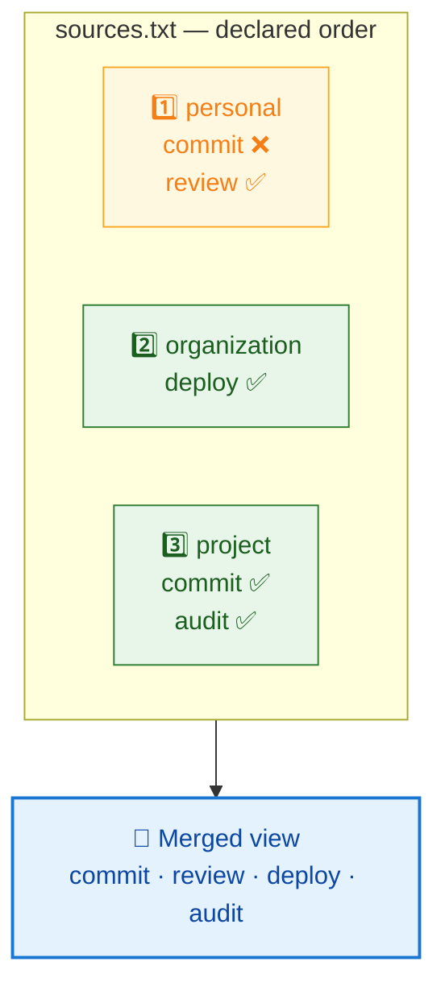

# Precedence and shadowing 🥇

Two layers both ship a skill named `commit`. Only one name can exist in the
merged view, so one of them is **shadowed**. This page is about which, why, and
how to see it.

## The rule 📏

**The last declaration wins, and it wins whole.**



Layers are declared from the most **general** to the most **specific** — you,
then your organization, then the project — so "last wins" reads as "the local
definition beats the global one", which is what you want it to mean.

## What "whole" means 🧱

The unit of collision is the **entry**: the name that sits directly under a kind
directory. When an entry is shadowed, the winner supplies *all* of it.

Suppose `personal` and `project` both have a `commit` skill:

```
personal/skills/commit/       project/skills/commit/
  SKILL.md                      SKILL.md
  helper.sh
```

The merged view shows `project`'s version, and **`helper.sh` is not visible** —
not even though nothing in `project` collides with it. There is no per-file
merge, no fallback into the losing layer, and therefore no way to end up with a
skill assembled from two repositories that were never tested together.

An entry may be a directory (a skill, with its `SKILL.md` and supporting files)
or a single file (a command stored as one Markdown document). Which it is comes
from the layer; `airfs` imposes neither. A name that is a directory in one layer
and a file in another still resolves to exactly one of them — the last — with no
reconciliation attempted.

## Precedence is per kind 🏷️

Each kind is merged independently. A layer can win `commit` under `skills` while
losing `commit` under `commands`. There is one ordering — the file's — applied
four times.

## Seeing it 🔍

Shadowing is only dangerous when it is silent: you edit a file, nothing changes
in the view, and nothing tells you why. So `airfs sources` names every shadowed
entry with its winner and its losers:

```bash
airfs sources
```

```
target  /home/you/.ai-resources
config  /home/you/.ai-resources/sources.txt

Sources, in precedence order — the last declaration wins:
  1. ~/ai/personal    agents 0  skills 2  commands 0  scripts 0
  2. $WORK/platform   agents 0  skills 0  commands 1  scripts 0
  3. ~/ai/project     agents 0  skills 2  commands 0  scripts 0

Empty kinds: agents, scripts

Shadowed entries — the winner is what the view serves:
  skills/commit  wins ~/ai/project  over ~/ai/personal
```

Read it as three answers:

- **The order** — is my repository being layered, and where?
- **The counts** — is it contributing what I think it is? A `skills 0` next to a
  repository you know has skills means the path is wrong, or the resources are
  not under a kind directory.
- **The shadowing** — which entries are contested, and who is winning.

Layers are named by the path **you declared**, not by a resolved symlink target,
so the report matches your file line for line.

!!! success "Shadowing is not an error"

    `airfs sources` exits `0` with shadowed entries reported. Shadowing is the
    mechanism working — an exit code that punished it would make the normal case
    indistinguishable from a broken configuration. When nothing is contested, the
    report says `Nothing is shadowed.`

## Changing who wins ✍️

There is exactly one lever: **the order of the lines**. Move a layer later to
give it precedence, earlier to yield it. Nothing else — no priority number, no
per-entry override, no exclusion list — because a second mechanism would make
"which one is served?" a question with two places to look.

If you want a project's `commit` skill to lose to your personal one, move your
personal layer below it. If you want to stop shipping an entry entirely, remove
it from the layer that ships it — in that repository, where it is reviewed.

## Why not merge content? 🤔

Because the merge would have to invent a resolution nobody wrote. A skill is a
directory of files that are meant to agree with each other; taking `SKILL.md`
from one repository and a helper script from another produces something that
exists in no repository, is tested nowhere, and cannot be reproduced by reading
either one. Winning whole keeps every served entry identical to an entry that
someone actually authored, reviewed, and can find in git.
